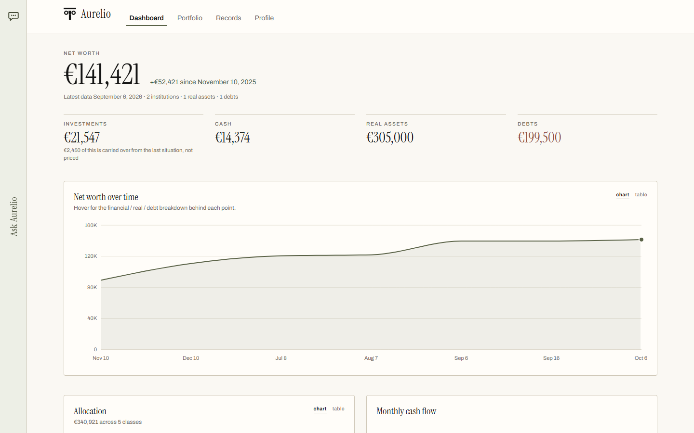
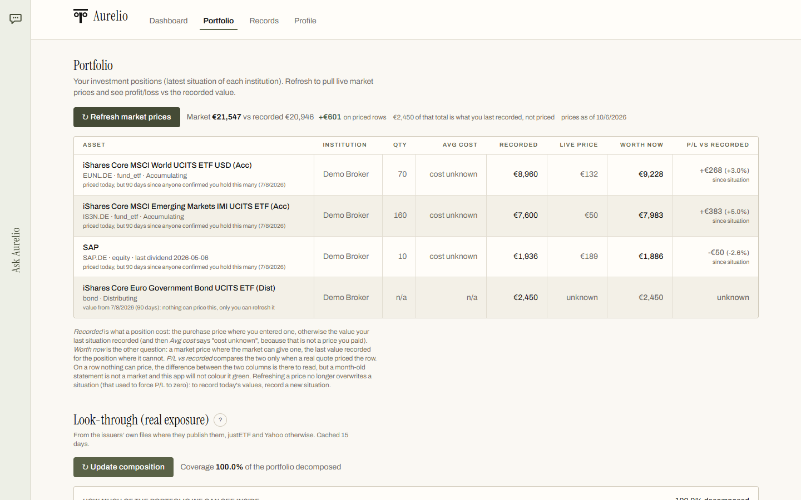
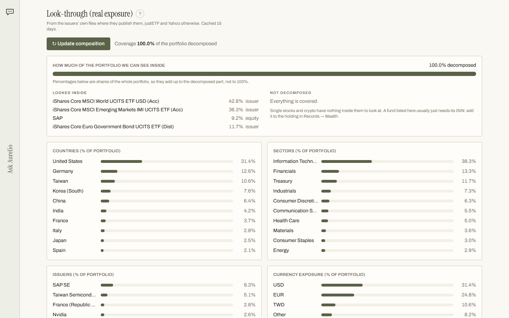
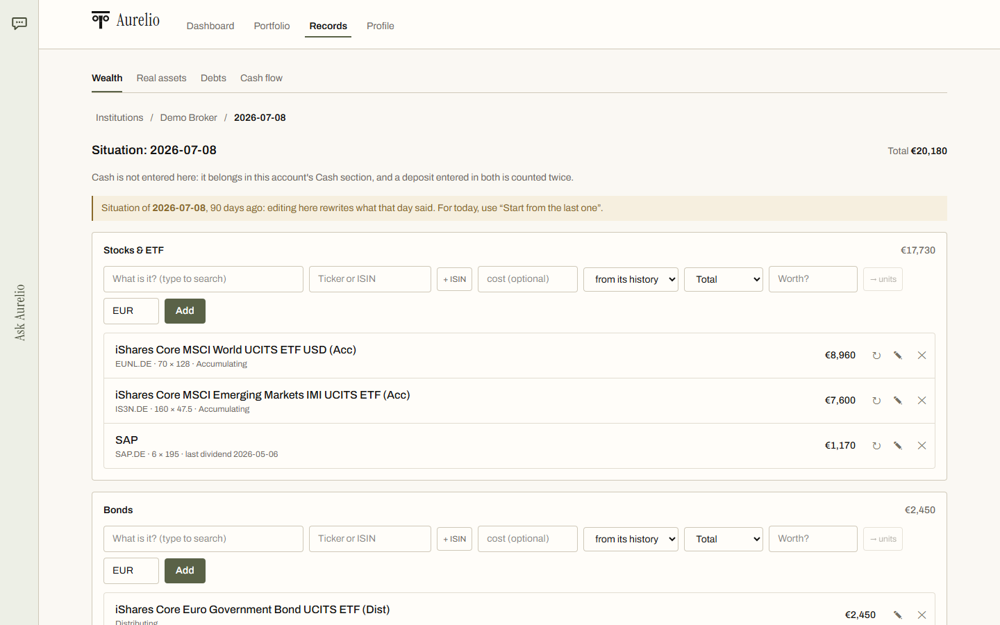
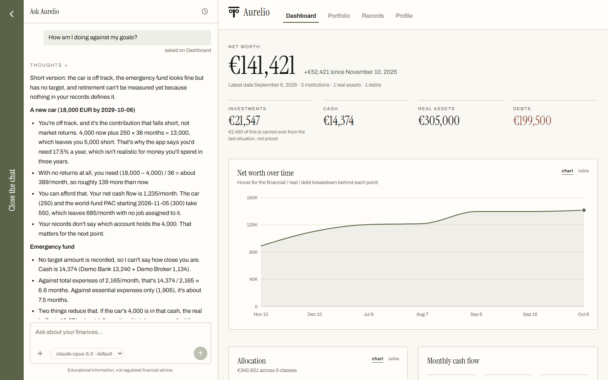
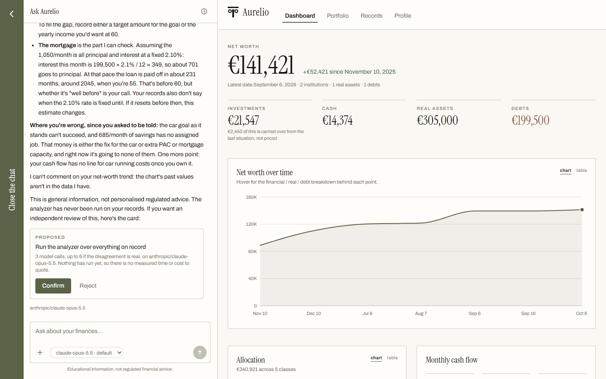

# Aurelio

[](https://github.com/LosaLosSantos/aurelio-finance/actions/workflows/ci.yml)

**Aurelio** is a wealth-management and financial-planning app that runs on your
own computer, with an AI advisor you can talk to. Your records live in a SQLite
file on your machine. The AI part is optional: it goes through
[OpenRouter](https://openrouter.ai) with your own key.

It is an educational project, not financial advice.

## Screenshots

All of them on the demo data (`./start.sh --demo`): an invented household,
nothing of anyone's.

| | |
|---|---|
| <br>*The Dashboard: net worth over time* | <br>*Positions priced from the market* |
| <br>*The look-through: what the funds hold* | <br>*A dated situation of one account* |
| <br>*The chat, answering from your records* | <br>*It proposes; you confirm or reject* |

## What it does

Everything rests on one idea: a **dated photograph** plus the **events after
it**. Each institution has situations, photographs of what it held on a day,
and the current position is the latest photograph projected forward with every
ledger entry that came later. A wrong number can then be traced either to a bad
photograph or to a bad event, and nothing is a running balance you have to
trust. [How Aurelio reasons](docs/how-aurelio-reasons.md) describes the model
and the rules the code defends.

- **Wealth**: institutions with a **live cash register** (an actual balance at
  a date, projected forward with linked income and expenses, transfers, and
  what the investment ledger spent or brought back) and dated **situations**
  of the positions held there.
- **Portfolio**: every position projected to today, priced from the market
  where a ticker can price it. A **ledger** of buys, sells, dividends and closes
  gives the real cost and the realized gain or loss; a position no source can
  price ages honestly and says so. **Look-through** opens the funds: country,
  sector and currency exposure of the whole portfolio, and the companies you
  own through more than one of them.
- **Dividends** of the funds and shares you hold, recorded by themselves from
  Yahoo's history (marked as estimates, to correct with what your broker
  credited).
- **Recurring investment plans**: a contribution, a schedule, one or more
  targets; elapsed purchases fill themselves in at the day's close.
- **Instrument picker**: a local catalogue of UCITS funds (ISIN, name,
  accumulating or distributing, cost), downloaded by the app, beside a live
  symbol lookup and the positions you already hold.
- **Real assets and debts**: homes, vehicles and the like with dated
  valuations; mortgages and loans with dated balances, linked to what they
  finance.
- **Cash flow**: income and expenses (active or passive, essential or
  discretionary, a frequency, start and end dates) and transfers between
  institutions.
- **Goals and profile**: goal types or a target amount by a date, with the
  required annual return computed live; a questionnaire about your life, plans
  and attitude to risk.
- **Ask Aurelio**: a chat over the whole picture, in a panel that follows you
  across the app. It reads your records, refuses to state a number that is not
  in them, can search the web (with Claude models) and lists the pages it used,
  and **proposes rather than writes**: anything that would change your records
  arrives as a card you confirm.
- **The analysis**: one of those cards. An analyst judges the portfolio, a
  confidant who knows you (and never sees a figure) argues back, the analyst
  answers where the challenge is contested, and a synthesis says what they
  still disagree on.
- **A read-only MCP server**, so Claude Desktop or another assistant can be
  asked about your portfolio outside the app.
- **One base currency** of your choice (the euro by default): every amount is
  converted at the ECB's rate of its own day before it is added up.

## Try it on invented data

You need [Git](https://git-scm.com), [Node.js](https://nodejs.org) 22 or later
(npm comes with it) and [uv](https://docs.astral.sh/uv/getting-started/installation/),
which installs the Python the backend needs (3.12) by itself. Then:

```bash
git clone https://github.com/LosaLosSantos/aurelio-finance.git
cd aurelio-finance
./start.sh --demo          # macOS and Linux
```

```powershell
git clone https://github.com/LosaLosSantos/aurelio-finance.git
cd aurelio-finance
./start.ps1 -Demo          # Windows, in PowerShell
```

If PowerShell answers that running scripts is disabled on this system, run
`powershell -ExecutionPolicy Bypass -File .\start.ps1 -Demo` instead: it allows
this one run and changes no setting.

The first start installs the dependencies inside the project folder
(`frontend/node_modules` and `backend/.venv`), builds the frontend, builds
`backend/demo.db`, and opens <http://localhost:8000>. The demo is an invented
household: a "Demo Bank" and a "Demo Broker", a salary and everyday expenses, a
few widely held funds and one share, a monthly plan, a flat and its mortgage,
three goals and some answers to the questionnaire. Its dates are counted back
from the day it is built, so it always ends today. Prices, dividends and the
look-through come from the market, as they would for your own records.

The demo lives in its own file. To leave it, start without the flag: the app
opens your own `backend/data.db` (empty the first time), which the demo never
touched. Delete `backend/demo.db` whenever you like; the next `--demo` builds a
fresh one.

## Run it on your own data

```bash
./start.sh                 # macOS and Linux
```

```powershell
./start.ps1                # Windows
```

Both build the frontend, start the backend on <http://localhost:8000> and open
the browser (`--no-browser` or `-NoBrowser` to skip that). Stop it with Ctrl+C.

Your records live in **`backend/data.db`**. It is never committed (`*.db` is in
`.gitignore`), and nothing in the app sends the file anywhere.

## The AI part: OpenRouter

The chat and the analysis need an OpenRouter key; everything else works
without one, and they say so when it is missing.

1. Create an account at <https://openrouter.ai>, add credit (it is prepaid),
   and create a key at <https://openrouter.ai/keys>. A credit limit on the key
   caps what it can ever spend.
2. Copy `backend/.env.example` to `backend/.env` and set `OPENROUTER_API_KEY`.
   `backend/.env` is never committed.
3. Optional: in OpenRouter's privacy settings you can opt out of providers that
   train on your data, and OpenRouter will not route your requests to them.

### Which model, and what it costs

The built-in default is **Claude Opus 5.5** (`anthropic/claude-opus-5.5`),
which OpenRouter lists at $4 per million input tokens and $20 per million
output tokens (read on 2026-10-06). You can pick another model in the chat's
menu, or set one in `backend/.env` (`OPENROUTER_MODEL`, or one per role of the
analysis).

What it cost on Opus 5.5, as OpenRouter reported it (where that was checked
against the key's balance, the two agreed to the cent):

| | cost |
|---|---|
| A first question answered in one round, nothing cached yet | $0.111 |
| A follow-up answered in one round | $0.017 |
| A conversation's first question: three rounds, two catalogue searches | $0.095 |
| A request for advice: one web search, three rounds, a suggestion card | $0.159 |
| One web search (Exa, through OpenRouter), inside such a question | about $0.02 |
| An analysis of five steps (two runs) | $0.33 |
| An analysis of six steps | $0.51 |

Measured between 2026-10-03 and 2026-10-06, the chat's figures on small
portfolios (a test one, and the demo for the first row). Every question sends the whole picture of your finances again, so a
larger portfolio costs more per question.
With Claude models the app asks OpenRouter to cache what a conversation has
already sent: on a measured two-question conversation that made the input 59%
cheaper. The chat may search the web only with Claude models, at most six
searches per question, five results each.

## Your data, backups and migrations

The schema is managed with **Alembic** and brought up to date when the app
starts, so your data survives every change to it. **Before it migrates the
database, the app copies it**, next to it, as
`data.db.bak-<date>-<time>-before-migration-<from>-to-<to>`, and never
migrates without that copy: if the copy cannot be made, the app does not
start, changes nothing, and says why. If the migration itself fails, the app
writes the copy back and says so. The app never deletes a copy; remove old ones
yourself.

`uv run alembic upgrade head`, run by hand from `backend/`, migrates too, but
**takes no copy**: copy `data.db` yourself first, or simply start the app.

To see a failed migration's whole error, run
`uv run uvicorn app.main:app --log-level debug` from `backend/` once.

## Ask it from another assistant (MCP)

Aurelio ships a small **MCP server** with five read-only tools: the whole
financial picture, the current positions, the fund catalogue, a symbol lookup,
and what the last analysis concluded. Add it to your client's MCP
configuration (Claude Desktop: Settings, then Developer, then Edit Config),
with the path changed to wherever you keep this folder:

```json
{
  "mcpServers": {
    "aurelio": {
      "command": "uv",
      "args": [
        "--directory", "/path/to/aurelio-finance/backend",
        "run", "python", "-m", "app.mcp_server"
      ]
    }
  }
}
```

**It cannot write, and not as a promise**: the database is opened in SQLite's
read-only mode, so a write is refused by the database engine. To point it at a
copy instead of your records, set `AURELIO_MCP_DB=./some-copy.db` when you run
`uv run python -m app.mcp_server` from `backend/`.

## Development

For day-to-day work, two terminals: the frontend reloads as you edit, and Vite
sends `/api` to the backend.

```bash
cd backend                    # first terminal
uv sync
uv run uvicorn app.main:app --port 8000
```

```bash
cd frontend                   # second terminal
npm install
npm run dev                   # http://localhost:5173
```

Tests: `uv run pytest` in `backend/`; `npm test` and `npm run build` in
`frontend/`. `npm run build` first regenerates `src/api/schema.d.ts` from the
backend's OpenAPI document, so a field added to a Pydantic model and forgotten
in the frontend is a type error.

| Layer | Tech |
|---|---|
| Backend | Python 3.12, FastAPI, SQLAlchemy 2, Alembic, SQLite, uv |
| Frontend | React, TypeScript, Vite, Tailwind CSS v4, Recharts |
| AI | OpenRouter (OpenAI-compatible API) |
| Tests | pytest, Node's test runner, GitHub Actions |

## License

MIT, see [LICENSE](LICENSE).
